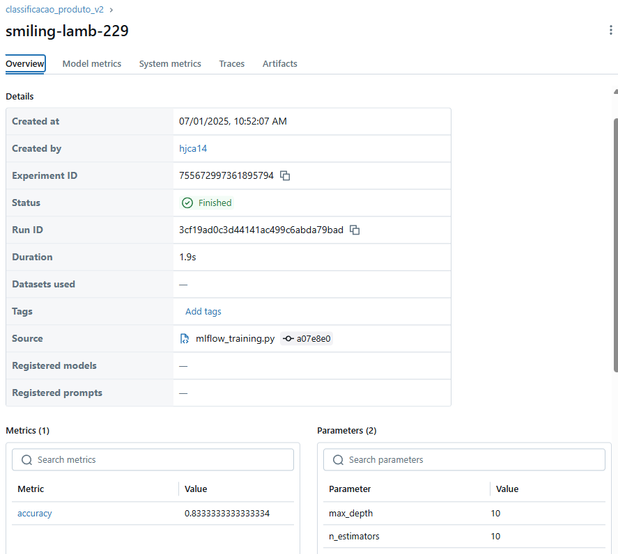

# Registro de Experimentos com MLflow
Este projeto demonstra como utilizar o MLflow para registrar parâmetros, métricas e modelos treinados durante experimentos de machine learning.

O objetivo é classificar descrições de produtos em categorias, usando diferentes combinações de hiperparâmetros e acompanhando os resultados com o MLflow.

# Estrutura
dados.csv: conjunto de dados com descrições e categorias

mlflow_training.py: script que treina o modelo com diferentes hiperparâmetros e registra tudo no MLflow

requirements.txt: dependências

# Como rodar
1. Instalar dependências
```bash
pip install -r requirements.txt
```
2. Rodar o script
```bash
python mlflow_training.py
```
3. Iniciar o MLflow UI
```bash
mlflow ui
```
4. Acesse em: http://localhost:5000


# O que é registrado
Durante cada execução, o MLflow armazena:

n_estimators e max_depth (parâmetros do modelo)

accuracy (métrica de desempenho)

O próprio modelo treinado (em Artifacts/)

# Melhor resultado encontrado
O melhor modelo foi o registrado na run:

 - Run ID: 3cf19ad0c3d44141ac499c6abda79bad
 - Experimento ID: 755672997361895794
 - Acurácia: 0.833



# Considerações Finais
A maioria dos modelos alcançou entre 0.5 e 0.666 de acurácia, indicando que o dataset ainda é limitado.

Mesmo com poucos exemplos, o uso do MLflow permitiu identificar rapidamente o melhor conjunto de parâmetros, facilitando a análise comparativa entre execuções.

O experimento pode ser refeito com dados reais ou mais robustos para melhores resultados.