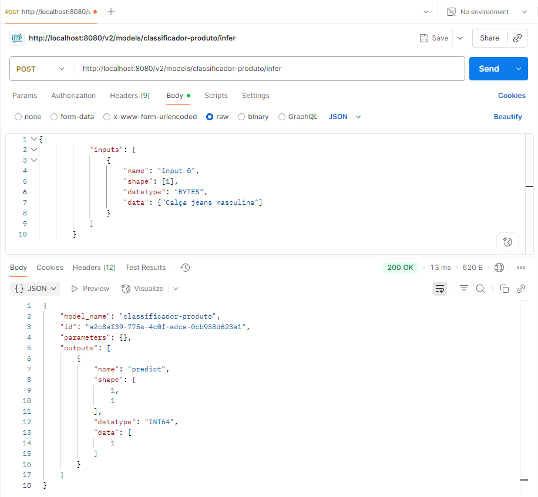

# Configuração do MLServer com Modelo Próprio

## Descrição
Este projeto foi desenvolvido como parte de um exercício prático de aula, com o objetivo de configurar o MLServer para hospedar e servir um modelo de Machine Learning utilizando Docker.

#### A proposta consiste em:

- Escolher e treinar um modelo próprio.
- Configurar o MLServer com esse modelo.
- Disponibilizar o serviço via Docker para facilitar a replicação e execução do projeto.

O modelo escolhido neste projeto foi um classificador de textos baseado no dataset fetch_20newsgroups, utilizando uma pipeline com TfidfVectorizer e MultinomialNB da biblioteca scikit-learn.

---
## Estrutura do Projeto
```graphql
├── Dockerfile
├── model_settings.json      # Configurações do MLServer para carregar o modelo
├── model_training.py        # Script de treinamento e serialização do modelo
├── requirements.txt         # Dependências do projeto
├── tests/
│   └── test_mlserver.py     # Testes automatizados com pytest
└── .github/
    └── workflows/
        ├── ci.yml          # Workflow de integração contínua (CI)
        └── cd.yml          # Workflow de entrega contínua (CD)
```

---
## Como Executar
### Pré-requisitos
 - Docker
 - Git

### Passos
Clone o repositório:

```bash
git clone https://github.com/hjca14/MLP.git
cd MLP
git checkout EML3.1
```

### Construa a imagem Docker:

```bash
docker build -t classificador-produto .
```

### Execute o container:
```bash
docker run -d -p 8080:8080 --name classificador classificador-produto
```

### Faça uma requisição de inferência:
Exemplo de payload JSON:

```json
{
  "inputs": [
    {
      "name": "input-0",
      "shape": [1],
      "datatype": "BYTES",
      "data": ["Calça jeans masculina"]
    }
  ]
}
```

### Use ferramentas como Postman:


---
## Sobre o Modelo
Pipeline: TfidfVectorizer + MultinomialNB

Dataset: Subconjunto do fetch_20newsgroups com as categorias:

- rec.autos
- comp.sys.mac.hardware
- sci.space

O modelo foi treinado e serializado com joblib como model.pkl.

---
## Automação
Este projeto conta com automação via GitHub Actions:

### CI
Executa testes automatizados com pytest e coverage sempre que há push ou pull request para a branch EML3.1.

### CD
Automatiza o processo de build e deploy no Docker Hub sempre que há push ou pull request para a branch EML3.1.

---
## Testes
Os testes de integração verificam se a API está funcionando corretamente e se o modelo responde adequadamente a uma requisição de inferência.

### Execute localmente com:

```bash
pytest --cov=./ --cov-report=term-missing
```